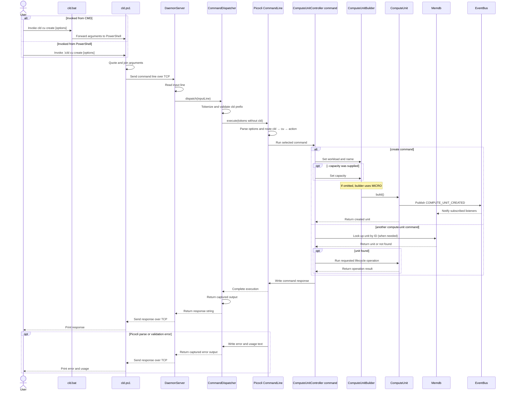

# Current CLI Dispatcher Workflow

```mermaid
sequenceDiagram
    actor User
    participant Batch as cld.bat
    participant Wrapper as cld.ps1
    participant Daemon as DaemonServer
    participant Dispatcher as CommandDispatcher
    participant Picocli as Picocli CommandLine
    participant Action as ComputeUnitController command
    participant Builder as ComputeUnitBuilder
    participant Unit as ComputeUnit
    participant Memdb
    participant EventBus

    alt Invoked from CMD
        User->>Batch: Invoke cld cu create [options]
        Batch->>Wrapper: Forward arguments to PowerShell
    else Invoked from PowerShell
        User->>Wrapper: Invoke .\cld cu create [options]
    end
    Wrapper->>Wrapper: Quote and join arguments
    Wrapper->>Daemon: Send command line over TCP
    Daemon->>Daemon: Read input line
    Daemon->>Dispatcher: dispatch(inputLine)
    Dispatcher->>Dispatcher: Tokenize and validate cld prefix
    Dispatcher->>Picocli: execute(tokens without cld)
    Picocli->>Picocli: Parse options and route cld → cu → action
    Picocli->>Action: Run selected command

    alt create command
        Action->>Builder: Set workload and name
        opt --capacity was supplied
            Action->>Builder: Set capacity
        end
        Note over Builder: If omitted, builder uses MICRO
        Builder->>Unit: build()
        Unit->>EventBus: Publish COMPUTE_UNIT_CREATED
        EventBus-->>Memdb: Notify subscribed listeners
        Unit-->>Action: Return created unit
    else another compute-unit command
        Action->>Memdb: Look up unit by ID (when needed)
        Memdb-->>Action: Return unit or not found
        opt unit found
            Action->>Unit: Run requested lifecycle operation
            Unit-->>Action: Return operation result
        end
    end

    Action->>Picocli: Write command response
    Picocli-->>Dispatcher: Complete execution
    Dispatcher->>Dispatcher: Return captured output
    Dispatcher-->>Daemon: Return response string
    Daemon-->>Wrapper: Send response over TCP
    Wrapper-->>User: Print response

    opt Picocli parse or validation error
        Picocli->>Dispatcher: Write error and usage text
        Dispatcher-->>Daemon: Return captured error output
        Daemon-->>Wrapper: Send response over TCP
        Wrapper-->>User: Print error and usage
    end
```
